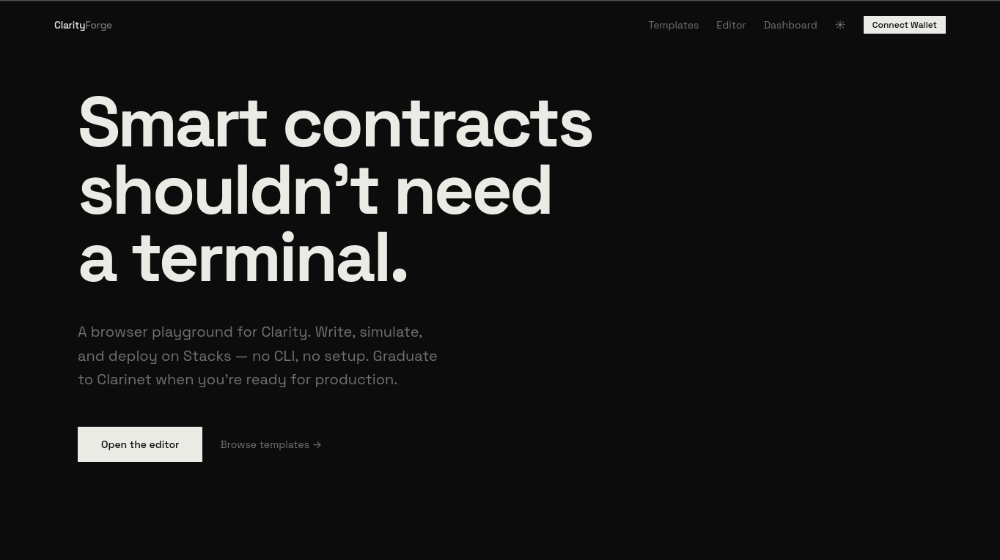
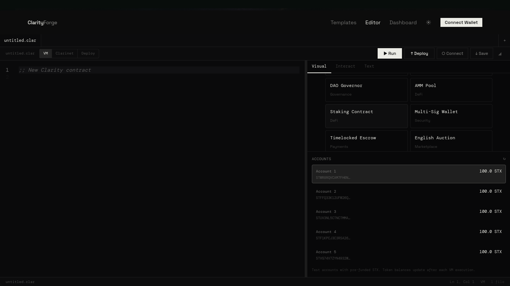

<div align="center">


&nbsp;

[](https://clarityforge-sigma.vercel.app)
[](https://x.com/KomariS18774/status/2077757620262486182)
[](https://github.com/subheeksh5599/ClarityForge)
[](LICENSE)
[](https://stacks.co)


### Stacks has a CLI playground. It didn't have a visual IDE. ClarityForge is that.

| | ClarityForge | Stacks Labs Playground | Clarinet | VSCode Extension |
|---|:---:|:---:|:---:|:---:|
| **Runs in browser** | ✅ | ✅ | ❌ (local CLI) | ❌ (desktop) |
| **Monaco code editor** | ✅ | ❌ (terminal only) | ❌ | ✅ |
| **One-click templates** | ✅ 12 | ❌ | ❌ | ❌ |
| **Visual state inspector** | ✅ | ❌ | ❌ | ❌ |
| **Interact panel (call functions)** | ✅ | ❌ | ✅ (CLI) | ❌ |
| **Wallet deploy to testnet** | ✅ | ❌ | ❌ | ❌ |
| **Shareable snippet links** | ✅ | ❌ | ❌ | ❌ |
| **Zero install / signup** | ✅ | ✅ | ❌ | ❌ |
| **Clarinet SDK / real VM** | ❌ (simulator) | ✅ | ✅ | ✅ |

ClarityForge is not a replacement for Clarinet or the playground — it's the missing visual layer. Write, analyze, simulate, and deploy in a browser tab. When you're ready for production, graduate to Clarinet.

**This is not finished.** The editor, VM, templates, and deploy pipeline all work — but the VM covers basic patterns (transfers, mints, votes, staking), not the full Clarity runtime. Template coverage stops at 12. Error diagnostics are syntactic, not semantic. A DeGrant would fund deeper simulation, richer diagnostics, and more templates — turning a working prototype into a complete on-ramp for new Stacks devs.

### ▶ Live now — write, simulate, and deploy at **[clarityforge-sigma.vercel.app](https://clarityforge-sigma.vercel.app)**

**[ Live demo ↗ ](https://clarityforge-sigma.vercel.app)** · **[ Open the editor ↗ ](https://clarityforge-sigma.vercel.app/demo)** · **[ Browse templates ↗ ](https://clarityforge-sigma.vercel.app/templates)** · **[ Dashboard ↗ ](https://clarityforge-sigma.vercel.app/dashboard)** · **[ See it in one command ↓ ](#-see-it-in-one-command)** · **[ Honesty table ↓ ](#whats-real-vs-pending--the-honesty-table)** · **[ Architecture ↓ ](#architecture)**

Built for the Stacks developer ecosystem. MIT licensed. _An educational tool — graduate to Clarinet for production contracts._

<br />

<table>
  <tr>
    <td width="50%"></td>
    <td width="50%"></td>
  </tr>
  <tr>
    <td align="center"><sub>Landing page</sub></td>
    <td align="center"><sub>Editor — Monaco with VM, analysis, and deploy</sub></td>
  </tr>
</table>

</div>

---

## Table of contents

- [See it in one command](#-see-it-in-one-command)
- [The problem ClarityForge solves](#the-problem-clarityforge-solves)
- [The one rule — complement, don't compete](#the-one-rule--complement-dont-compete)
- [How ClarityForge works](#how-clarityforge-works)
  - [1 · The editor — Monaco with real Clarity syntax](#1--the-editor--monaco-with-real-clarity-syntax)
  - [2 · Static analysis — tokenizer + analyzer](#2--static-analysis--tokenizer--analyzer)
  - [3 · Browser VM — stateful, like Remix VM](#3--browser-vm--stateful-like-remix-vm)
  - [4 · Three environments](#4--three-environments)
  - [5 · Wallet deployment](#5--wallet-deployment)
  - [6 · Template library](#6--template-library)
- [Architecture](#architecture)
- [How it uses Stacks](#how-it-uses-stacks)
- [Safety, enforced in code](#safety-enforced-in-code)
- [Engineering decisions & the hard problems](#engineering-decisions--the-hard-problems)
- [What's real vs pending — the honesty table](#whats-real-vs-pending--the-honesty-table)
- [Run it locally](#run-it-locally)
- [Configuration](#configuration)
- [Deploy](#deploy)
- [Project layout](#project-layout)
- [Tech stack](#tech-stack)
- [Roadmap](#roadmap)
- [Why previous attempts failed](#why-previous-attempts-failed)
- [License](#license)

---

## ▶ See it in one command

The analysis API is the product in one curl call. This is real output from the deployed service — verify it yourself right now:

```bash
$ curl -s -X POST https://clarityforge-sigma.vercel.app/api/analyze \
  -H 'Content-Type: application/json' \
  -d '{"code":"(define-fungible-token my-token u1000000)\n(define-public (transfer (amount uint) (recipient principal))\n  (begin\n    (try! (ft-transfer? my-token amount tx-sender recipient))\n    (ok true)))"}'

{
  "valid": true,
  "diagnostics": [],
  "definitions": [
    { "type": "fungible-token", "name": "my-token", "line": 1 },
    { "type": "public-fn", "name": "transfer", "line": 2,
      "params": [
        { "name": "amount", "type": "uint" },
        { "name": "recipient", "type": "principal" }
      ] }
  ],
  "stats": { "totalLines": 5, "functions": 1, "tokens": 36, "dataVars": 0, "maps": 0 },
  "costEstimate": 1950
}
```

The function parameters — `amount: uint`, `recipient: principal` — are extracted straight from the token stream. That structured output drives the editor's Interact tab and the VM. Now simulate a deploy (no wallet needed):

```bash
$ curl -s -X POST https://clarityforge-sigma.vercel.app/api/deploy \
  -H 'Content-Type: application/json' \
  -d '{"code":"(define-fungible-token my-token u1000000)"}'

{
  "txHash": "0x…",
  "contractId": "ST1PQHQKV0RJXZFY1DGX8MNSNYVE3VGZJSRTPGZGM.my-token-…",
  "network": "testnet",
  "blockHeight": 143…
}
```

That's the entire product: parse → analyze → simulate → (with a wallet) real testnet deploy. No chain state to sync. No Rust toolchain. No setup.

> **Heads up:** the no-wallet deploy above is a **simulation** — the `txHash` is generated for prototyping and won't resolve on an explorer. For a real, verifiable on-chain transaction, connect Leather/Xverse in the editor (see [Wallet deployment](#5--wallet-deployment)).

---

## The problem ClarityForge solves

Getting started with Clarity today means a wall of setup before you write a single line:

- **Install the Rust toolchain** — Clarinet is the gold standard, but it's a native binary and a project scaffold before you can type `(ok true)`.
- **No zero-setup visual IDE** — Stacks Labs built a great [CLI-style playground](https://play.stackslabs.com) (REPL with Clarinet SDK). Ethereum has Remix (500K+ monthly users) with a full visual editor, state inspector, and deploy pipeline. Stacks was missing that visual layer — until now.
- **The feedback loop is slow for learning** — spin up a project, write, `clarinet check`, read the output, repeat. Great for production, heavy for a first hour.
- **Templates are scattered** — SIP-010, SIP-009, DAO, AMM patterns live across docs and repos, not one click away.

ClarityForge collapses that first hour into a browser tab: type, analyze, simulate against a stateful VM, deploy to testnet — then graduate to Clarinet when the training wheels come off.

---

## The one rule — complement, don't compete

Clarinet is the gold standard for Clarity development. It's maintained by the Stacks Foundation, battle-tested across thousands of contracts, and the right tool for production work. **ClarityForge does not replace Clarinet. It is the step before it.**

The rule is enforced at **three** levels:

1. **Architecture** — ClarityForge uses pure TypeScript static analysis, not the Clarity VM. It can't execute arbitrary Clarity code — only Clarinet can. The VM tab runs a simulator, not the real runtime, and it says so in the UI.
2. **Copy** — Every page, this README, the landing copy, and the editor footer say the same thing: graduate to Clarinet for production.
3. **Scope** — No test framework, no CI integration, no mainnet deploy. Those are Clarinet's domain. We stay in our lane — the on-ramp.

What we learned from the ecosystem's history:

| Project | What they did | Outcome |
|---------|----------------|---------|
| **clarity-wasm** | Compile the full Clarity VM (30K+ lines of Rust) to WebAssembly | Tied to stacks-core upstream — broke on every change, repo deleted |
| **clarity-js-sdk** | Wrap the VM in JavaScript (413 commits over 5 years) | Wrapping a moving target is exhausting — archived |
| **clarity-lsp** | Language server protocol for Clarity | Merged into Clarinet — the right call, consolidation beats fragmentation |
| **Stacks Labs Playground** | CLI-style REPL in the browser (Clarinet SDK + Simnet) | ✅ Live at [play.stackslabs.com](https://play.stackslabs.com) — a great tool, but it's a terminal, not an IDE |

Our approach: **pure TypeScript, zero upstream dependencies on the Clarity VM.** The tokenizer, analyzer, and simulator are self-contained. They don't execute real Clarity — but they cover most of what a browser playground needs, and they never break. ClarityForge adds what the REPL doesn't: a Monaco editor, visual state inspector, interact panel, 12 templates, wallet deploy, and shareable snippets.

---

## How ClarityForge works

Six capabilities, each documented with the mechanism behind it. All are live at [clarityforge-sigma.vercel.app](https://clarityforge-sigma.vercel.app).

### 1 · The editor — Monaco with real Clarity syntax

The editor is Monaco — the same editor that powers VS Code. ClarityForge registers a custom language definition with **50+ keywords** and proper token coloring for comments, strings, integers, uints, principals, and s-expressions. **35 autocomplete snippets** cover every `define-*` form, all `ft-*`/`nft-*` builtins, map/var operations, control flow, and contract calls. The language registers in `beforeMount` — no separate extension, no marketplace dependency. It ships with the app.

### 2 · Static analysis — tokenizer + analyzer

```
POST /api/analyze
{ "code": "..." }

→ {
    "valid": true | false,
    "definitions": [{ type, name, line, params? }],
    "diagnostics": [{ line, col, message, severity }],
    "stats": { totalLines, functions, tokens, dataVars, maps },
    "costEstimate": number
}
```

The pipeline: tokenize (50+ keywords → typed tokens) → validate (balanced parens, non-empty) → extract (fungible-tokens, NFTs, functions, data-vars, maps, constants, traits) → extract function parameters from each signature → compute stats → estimate cost. All in TypeScript. No `eval`, no shell, no file I/O.

### 3 · Browser VM — stateful, like Remix VM

```
┌──────────────────────────────────┐
│         ClarityForge VM          │
│                                  │
│  5 test accounts (100 STX each)  │
│  Stateful storage across calls   │
│  Token balances, data-vars, maps │
│  Transfer → balance → verify     │
│  Mint → owner → check            │
│  Propose → vote → tally          │
│  Stake → unstake → rewards       │
│                                  │
│  Runs in your browser — no chain │
└──────────────────────────────────┘
```

The VM is a stateful in-browser simulator. It initializes from your contract's definitions (allocates tokens to the deployer, seeds data-vars, creates map structures). Each call reads from and writes to that state, and the state persists across calls — transfer tokens, then query the balance, and the balance dropped. Every execution produces a **trace** — a step-by-step log of reads, writes, transfers, events, and the return value — plus a cost estimate in µSTX. It's not the real Clarity runtime, and the UI says so.

### 4 · Three environments

| Environment | What it does | When to use |
|------------|-------------|------------|
| **VM** (default) | Browser simulator, stateful, no setup | Learning, prototyping, experimenting |
| **Clarinet** | Runs `clarinet check` against the real VM (server-side, if the binary is present) | Validating syntax, catching real errors |
| **Deploy** | Wallet-connected testnet deployment | Going live, sharing with others |

The environment selector sits in the editor toolbar — a three-button toggle, like Remix's environment dropdown. If no Clarinet binary is present on the server, Clarinet mode falls back to the static analyzer and labels the result `"vm": "static"` — never a false claim.

### 5 · Wallet deployment

Connect your Leather or Xverse wallet via the native SIP-030 `window.StacksProvider` API — **zero npm dependencies** for wallet functionality. Click Deploy, and your contract goes live on Stacks **testnet** via `stx_deployContract`. You get back a transaction ID with clickable Hiro explorer links:

```
✓ Contract deployed to testnet!

Name: my-token
Contract: ST1PQH…my-token
TxID: 0x…

→ Transaction: https://explorer.hiro.so/txid/0x…?chain=testnet
→ Contract: https://explorer.hiro.so/address/ST1PQH…my-token?chain=testnet
```

Every network reference is hardcoded to **testnet** — no mainnet path exists in the code. Without a wallet, Deploy runs a simulation (clearly labeled) that generates a realistic tx hash + contract ID for prototyping.

### 6 · Template library

Twelve production-ready Clarity contracts, one click away — every one deploys cleanly on testnet:

| Template | Tag | What it shows |
|----------|-----|--------------|
| **SIP-010 Token** | Fungible Token | Fungible token: define, transfer, balance query, supply |
| **SIP-009 NFT** | NFT | Non-fungible token: mint with counter, owner query, transfer |
| **DAO Governor** | Governance | Governance: proposal map, vote map, counter, propose + vote |
| **AMM Pool** | DeFi | DeFi: pool creation, reserves, liquidity |
| **Staking** | DeFi | Stake/unstake/claim, block-height-based rewards |
| **Multi-Sig** | Security | N-of-M owners, propose + sign transactions |
| **Escrow** | Payments | P2P exchange with arbiter dispute resolution + auto-refund |
| **English Auction** | Marketplace | Ascending-price bids, outbid refund, seller finalization |
| **Crowdfunding** | Payments | Goal-based fundraising with auto-refund if goal not met |
| **Token Vesting** | DeFi | Cliff + linear vesting schedule, admin-managed beneficiaries |
| **Name Registry** | Identity | BNS-style namespace → name → owner resolution |
| **Streaming Payments** | Payments | Real-time money streaming — pay per block, cancel anytime |

Each template opens in the editor with one click. Edit, analyze, simulate, deploy. All follow Stacks standards — SIP-010, SIP-009.

---

## Architecture

```
┌────────────────────────────────────────────────────────────────┐
│                        BROWSER                                 │
│                                                                │
│  ┌──────────┐  ┌──────────────┐  ┌──────────────────────────┐ │
│  │  Monaco   │  │  Stateful VM │  │  Wallet (SIP-030)        │ │
│  │  Editor   │  │  Simulator   │  │  Leather / Xverse        │ │
│  │  (Clarity │  │  5 accounts  │  │  deploy + sign           │ │
│  │  language)│  │  balances    │  │                          │ │
│  └────┬─────┘  └──────┬───────┘  └────────────┬─────────────┘ │
│       │               │                       │                │
└───────┼───────────────┼───────────────────────┼────────────────┘
        │               │                       │
        ▼               ▼                       ▼
┌────────────────────────────────────────────────────────────────┐
│                   NEXT.JS 16 (Vercel)                          │
│                                                                │
│  /api/analyze     /api/deploy     /api/execute     /api/accounts│
│  ┌──────────┐     ┌──────────┐     ┌──────────┐    ┌─────────┐│
│  │Tokenizer │     │Simulated │     │Clarinet  │    │Faucet   ││
│  │→ Analyzer│     │tx hash   │     │check     │    │accounts ││
│  │→ JSON    │     │+ contract│     │(optional)│    │         ││
│  └──────────┘     └──────────┘     └──────────┘    └─────────┘│
│                                                                │
│  Static pages: /  /demo  /templates  /og                       │
└────────────────────────────────────────────────────────────────┘
```

### Analysis pipeline

```
Source Code
    │
    ▼
Tokenizer (src/lib/clarity/tokenizer.ts)
  • 50+ keywords · comments, strings, uints, principals, types
  • Parenthesis tracking
    │
    ▼
Analyzer (src/lib/clarity/analyzer.ts)
  • Balanced-paren validation
  • Definition extraction (tokens, NFTs, fns, maps, vars, constants, traits)
  • Parameter extraction from function signatures
  • Trait resolution (define-trait + impl-trait conformance checking)
  • Diagnostics with line numbers · cost estimation
    │
    ▼
API Response (structured JSON → state visualizer + VM init)
```

### VM execution model

```
Contract definitions → initStateFromContract()
  • Allocates tokens to deployer
  • Seeds data-vars with defaults
  • Creates map structures
    │
    ▼
Function call → executeInVm()
  • Reads tx-sender · validates params
  • Pattern match: transfer / mint / propose / vote / stake / unstake / read-only
  • Mutates state (balances, maps, data-vars) · emits events
  • Returns value + cost estimate
    │
    ▼
Updated state → AccountPanel (balances) + VmTrace (steps)
```

---

## How it uses Stacks

**Reads.** The five in-editor test accounts are Stacks testnet principals, served by `/api/accounts`. The Clarity language definition, SIP-010/SIP-009 templates, and analyzer all model real Stacks semantics.

**Writes.** With a wallet connected, `deployContract()` calls the SIP-030 `stx_deployContract` method against **Stacks testnet**. The resulting transaction is a real on-chain contract publish — verifiable on the Hiro explorer.

**Verified on Hiro.** Deployed contracts and their publish transactions resolve at `explorer.hiro.so/...?chain=testnet`. Every network parameter in the codebase — wallet connect, deploy, explorer links, simulation output — is `testnet`. There is no mainnet code path.

---

## Safety, enforced in code

| Concern | Enforcement | Layer |
|---------|------------|-------|
| Code injection | Pure parsing — no `eval()`, no `exec()`, no `new Function()` | Analyzer |
| Shell injection | `execSync` only runs the fixed `CLARINET_BIN` path; user params validated with `/^[a-zA-Z][a-zA-Z0-9_\-!?]*$/` before templating | Execute route |
| Resource exhaustion | 100 KB input limit, 5–30s timeouts per endpoint | All API routes |
| CSRF | Origin validation on all POST endpoints — only allowed origins pass | All API routes |
| Content-type attacks | Strict `application/json` enforcement — non-JSON rejected with 415 | All API routes |
| XSS | No `innerHTML`, no `dangerouslySetInnerHTML` anywhere — React handles escaping | All components |
| Wallet key exposure | `window.StacksProvider` (SIP-030) — the extension manages keys; ClarityForge never touches a private key or seed phrase | WalletProvider |
| Server key storage | The execute route wipes temporary Clarinet project dirs after each check in a `finally` block that runs on every path | Execute route |

The `execSync` in the execute route is the only system call in the codebase. It runs only the fixed Clarinet binary path, with user input validated before being written to a temporary file that is wiped even on errors and timeouts.

---

## Engineering decisions & the hard problems

- **Pure TypeScript, no VM dependency.** The three projects that came before all died tracking stacks-core upstream. ClarityForge's tokenizer, analyzer, and simulator are self-contained — they can't drift out of sync with a moving target, because they don't depend on one.

- **Honest about the simulator boundary.** The VM is a pattern-matched simulator, not the Clarity runtime. Rather than hide that, the UI, the API (`"vm": "static"`), and the honesty table all state it — and the whole product points users to Clarinet for real execution.

- **Parameter extraction from the token stream.** Clarity signatures nest — `(define-public (fn (p1 t1) (p2 t2)) body)`. The extractor walks the signature-wrapper paren, skips the function name, and reads each `(name type)` sub-list (including compound types like `(string-utf8 256)`) — so the Interact tab shows the right forms.

- **Zero-dependency wallet.** Instead of pulling in `@stacks/connect` (which broke SSR under Turbopack), wallet support talks directly to `window.StacksProvider` via SIP-030. Four runtime dependencies total.

- **Testnet-only by construction.** There is no network switch to get wrong. Every path is hardcoded to testnet, so a demo can't accidentally touch mainnet or real funds.

- **Fail-honest deploys.** No wallet → the deploy is explicitly a labeled simulation, never presented as an on-chain transaction.

---

## What's real vs pending — the honesty table

We want to be honest about what this project does and doesn't do:

| Feature | Status | Note |
|---------|:------:|------|
| Monaco editor with Clarity syntax highlighting | ✅ Real | Custom language, 50+ keywords, 35 snippets |
| Tokenizer (50+ keywords) | ✅ Real | `tokenizer.ts` — comments, strings, s-expressions, uints, principals |
| Static analyzer | ✅ Real | Balanced parens, definition + parameter extraction, diagnostics, cost |
| Browser VM simulator | ✅ Real | 5 test accounts, transfer, mint, propose/vote, staking, multi-sig |
| Three-environment selector (VM/Clarinet/Deploy) | ✅ Real | Toolbar toggle, switches execution mode |
| Wallet connect (Leather/Xverse) | ✅ Real | Native SIP-030, zero npm deps |
| Real testnet deploy | ✅ Real | Via wallet's `stx_deployContract`, with Hiro explorer links |
| Deploy simulation (no wallet) | ✅ Real | Clearly labeled — generates a tx hash + contract ID for prototyping |
| Clarinet integration | ✅ Real | Optional — runs `clarinet check` if the binary exists; else falls back to `"vm": "static"` |
| Twelve templates (+ custom), all deploy on testnet | ✅ Real | token, NFT, DAO, AMM, staking, multi-sig, escrow, auction, crowdfund, vesting, name-registry, streaming |
| OG image, dark/light theme, file tabs, localStorage, download, call graph | ✅ Real | — |
| Interact tab + execution trace + account balances | ✅ Real | Per-function execution against the VM |
| Custom template creation + dashboard | ✅ Real | Create templates from browser, saved to localStorage, edit/delete |
| Copy-to-clipboard on deploy output | ✅ Real | ⧉ button next to txHash and contractId |
| Clickable state visualizer | ✅ Real | Click any definition to jump to that line in the editor |
| GSAP scroll animations on landing | ✅ Real | Staggered hero reveal, section fade-ins, template card stagger |
| Loading skeletons | ✅ Real | Animated skeleton components replace all "…" placeholders |
| Persistent UI state | ✅ Real | Active tab and panel visibility saved to localStorage |
|| | | |
| Deep semantic validation (type checking, builtin arity) | ❌ Pending | Analyzer is syntactic — it does not check builtin arity. Use Clarinet. |
| Trait resolution | ✅ Real | Full define-trait + impl-trait parsing, conformance checking, typed diagnostics |
| Full Clarity runtime execution | ❌ Pending | VM is a simulator, not the real VM. Use Clarinet. |
| Test framework | ❌ Pending | Clarinet's test harness is the right tool |
| Server-side storage / sharing | ❌ Pending | localStorage only |
| Mainnet deploy | ❌ Pending | Testnet only, by design |

A hard rule: **nothing in the "pending" column is claimed as working until it ships.**

---

## Run it locally

```bash
git clone https://github.com/subheeksh5599/ClarityForge.git
cd ClarityForge
npm install
npm run dev
```

Open [http://localhost:3000](http://localhost:3000) and click **Open the editor**.

For Clarinet integration on the server:

```bash
# Install Clarinet (optional — enables real `clarinet check`)
curl -sL https://install.clarinet.rs | sh

# Or point ClarityForge to an existing binary
echo 'CLARINET_PATH=/path/to/clarinet' >> .env.local
```

Without Clarinet, the analyzer and VM still work — they just use static analysis.

---

## Configuration

| Variable | Default | Description |
|----------|---------|-------------|
| `CLARINET_PATH` | `/home/arch/.local/bin/clarinet` | Path to the Clarinet binary on the server |
| `NODE_ENV` | — | Set by Vercel. `development` disables CSRF origin checks |

Other configuration lives in the source — allowed origins in each API route, the template library in `src/lib/clarity/templates.ts`, and theme colors in `src/app/globals.css`.

---

## Deploy

| | |
|---|---|
| **App** | **[clarityforge-sigma.vercel.app](https://clarityforge-sigma.vercel.app)** — Vercel |
| **Editor** | **[/demo](https://clarityforge-sigma.vercel.app/demo)** |
| **Templates** | **[/templates](https://clarityforge-sigma.vercel.app/templates)** |
| **Network** | Stacks **testnet** (C-chain contract publish via wallet) |

```bash
npm i -g vercel
vercel --prod
```

The build output is static HTML + serverless API routes. No database, no persistent storage, no secrets beyond `CLARINET_PATH` if you want server-side Clarinet validation. On a custom domain, update the `ALLOWED_ORIGINS` array in each `src/app/api/*/route.ts` and the `metadataBase` in `src/app/layout.tsx`.

---

## Project layout

```
src/
├── app/
│   ├── page.tsx                  Landing page
│   ├── demo/page.tsx             Monaco editor + Run/Deploy + tabs + VM
│   ├── templates/page.tsx        Example contract browser
│   ├── dashboard/page.tsx        Project overview, stats, template table
│   ├── layout.tsx                Root layout, fonts, OG metadata
│   ├── globals.css               Dark/light 2-color system
│   ├── og/route.tsx              Dynamic OG image
│   └── api/
│       ├── analyze/route.ts      POST — static analysis
│       ├── deploy/route.ts       POST — deploy simulation
│       ├── execute/route.ts      POST — Clarinet check (optional)
│       └── accounts/route.ts     GET  — testnet accounts (faucet)
├── lib/clarity/
│   ├── tokenizer.ts              50+ keyword Clarity tokenizer
│   ├── analyzer.ts               Analysis + diagnostics + params + call graph
│   ├── executor.ts               Function execution simulator
│   ├── vm.ts                     Stateful browser VM (like Remix VM)
│   ├── templates.ts              11 production-ready contract templates
│   └── monaco-language.ts        Monaco language definition + 35 snippets
├── components/
│    ├── Nav.tsx                   Fixed nav + wallet connect + theme toggle
│    ├── Footer.tsx                Minimal footer
│    ├── StateVisualizer.tsx       Contract structure viewer + SVG call graph
│    ├── ClientProviders.tsx       Theme + wallet context wrapper
│    ├── ThemeProvider.tsx         Dark/light with localStorage
│    ├── WalletProvider.tsx        Native Stacks wallet (SIP-030, zero deps)
│    ├── AccountPanel.tsx          Pre-funded test accounts + token balances
│    ├── VmTrace.tsx               VM execution trace viewer (step-by-step)
│    └── ui/
│         └── stat-card.tsx        Shadcn-style stat card component
```

---

## Tech stack

- **Framework:** Next.js 16 (App Router, Turbopack)
- **Language:** TypeScript 5 (strict)
- **Editor:** Monaco Editor (`@monaco-editor/react` 4.7)
- **Styling:** Tailwind CSS 4 · Space Grotesk (display), DM Mono (code)
- **Icons:** Lucide React
- **Wallet:** Native `window.StacksProvider` (SIP-030) — zero deps
- **Analysis + VM:** Custom tokenizer, analyzer, and stateful simulator — pure TypeScript
- **Validation:** Optional Clarinet integration (`execSync`)
- **Deployment:** Vercel (serverless)

**Total runtime dependencies:** 6 — `next`, `react`, `react-dom`, `@monaco-editor/react`, `lucide-react`, `gsap`. The wallet, analyzer, VM, and templates are all hand-written — no third-party Stacks libraries.

---

## Roadmap

- **Shareable URLs** — encode a contract in the URL hash for instant sharing
- **Compiler output** — show the serialized contract and ABI (like Remix's compile tab)
- **Server-side storage** — optional accounts for saving contracts across devices
- **Test framework** — write and run unit tests in the browser
- **Mobile-optimized layout** — responsive editor for phones
- **SIP-010 token factory** — deploy tokens from a form, no code required
- **Mainnet deploy** — real gas estimation and fee-market awareness

---

## Why previous attempts failed

Several smart people tried to bring Clarity to the browser before us:

| Project | Approach | Failure mode |
|---------|----------|--------------|
| **clarity-wasm** | Compile the Clarity VM (30K+ lines of Rust) to WebAssembly | Tied to stacks-core upstream — broke on nearly every change. Repo deleted. |
| **clarity-js-sdk** | Wrap the VM in a JavaScript API (413 commits, 5 years) | Wrapping a moving target is exhausting. Archived. |
| **clarity-lsp** | Language Server Protocol for Clarity | Merged into Clarinet — the right call. Consolidation beats fragmentation. |

ClarityForge avoids all three failure modes: **no VM dependency, no upstream tracking, no tooling fragmentation.** Pure TypeScript analysis that runs anywhere — browser, server, CLI.

---

## License

MIT © [subheeksh5599](https://github.com/subheeksh5599)

---

Built with curiosity about Clarity and respect for the tools that came before it. Open the editor at [clarityforge-sigma.vercel.app/demo](https://clarityforge-sigma.vercel.app/demo) and build something.
